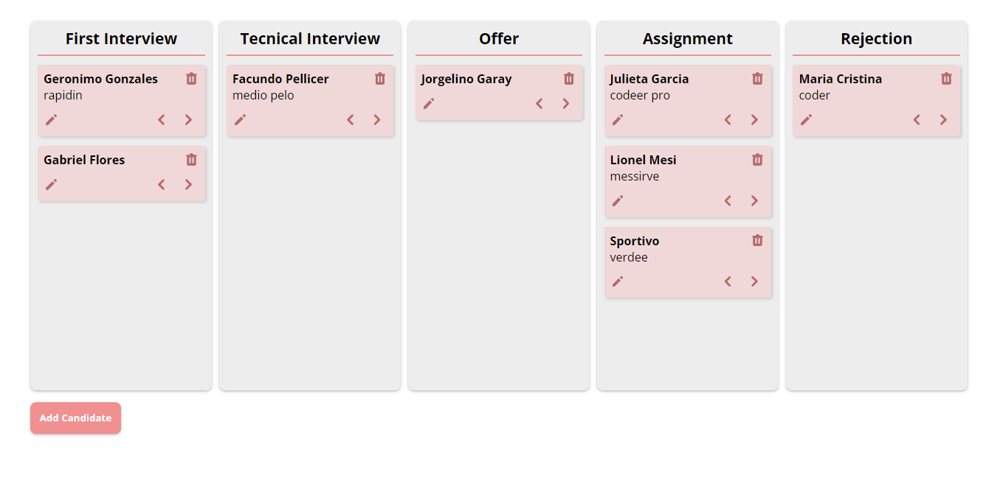
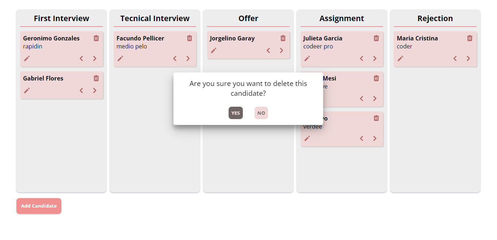
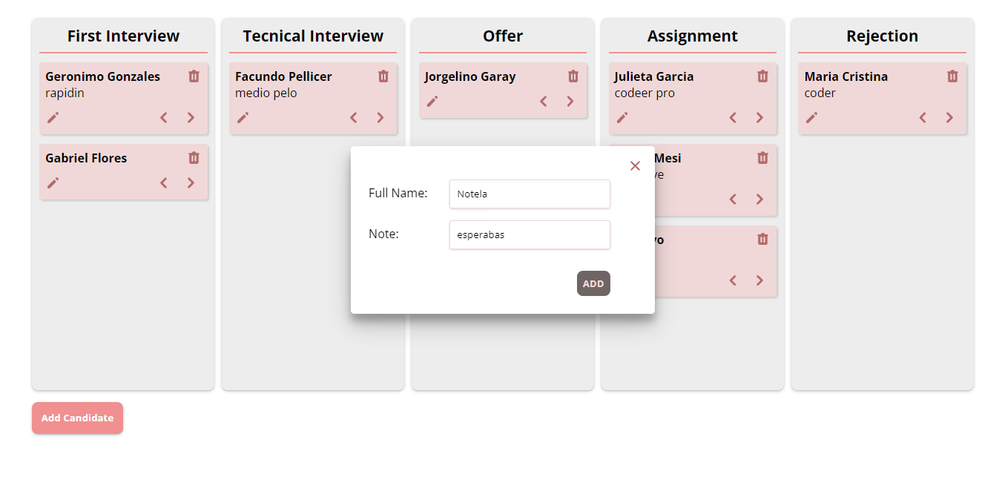
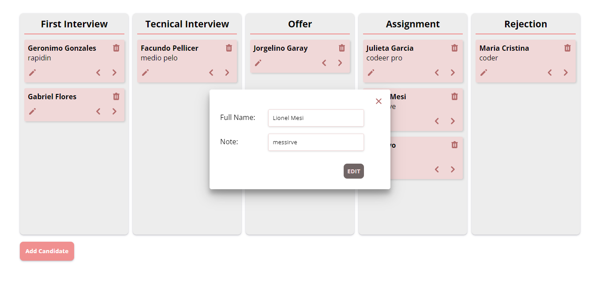

# React Challenge

Debemos implementar una columna por cada uno de los pasos de nuestro proceso ("Entrevista inicial" | "Entrevista técnica" | "Oferta" | "Asignación" | "Rechazo"), donde podamos tener candidatos que podamos mover entre columnas, una a la vez, sin saltar columnas. También podemos agregar candidatos a la primera columna y cada candidato puede tener opcionalmente un texto de comentario para saber como le está yendo en el proceso. Los candidatos pueden avanzar o retroceder con botones que se encuentran dentro de sus tarjetas.

### You can see the app deployed at: cognizant-challenge-delta.vercel.app

### Screens

